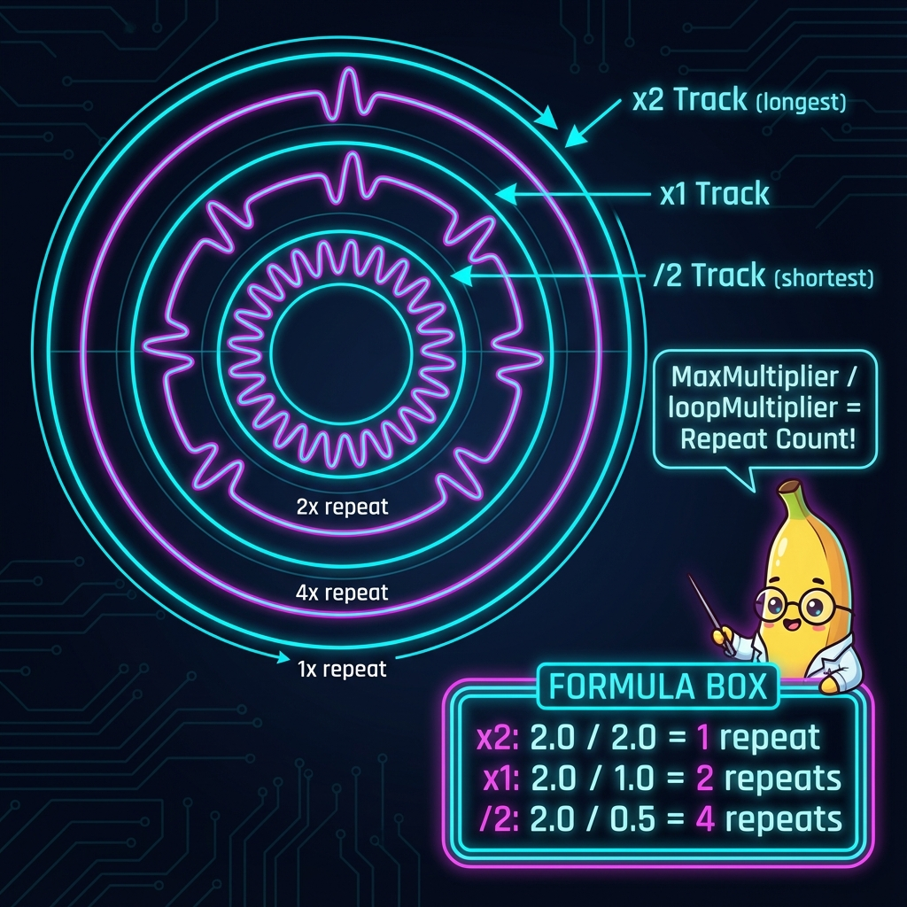

# トラック倍率と波形リピート表示

## 概要
SAROSのビジュアライザでは、異なる倍率のトラックが混在する場合、**最長トラックを基準**として各トラックの波形をリピート表示します。

## 表示ロジック



### 計算式
```
リピート回数 = MaxMultiplier / loopMultiplier
```

### 例（x2トラックが存在する場合）

| トラック | loopMultiplier | 実際の長さ   | リピート回数        |
| :------- | :------------- | :----------- | :------------------ |
| x2       | 2.0            | Master × 2   | 2.0 / 2.0 = **1回** |
| x1       | 1.0            | Master × 1   | 2.0 / 1.0 = **2回** |
| /2       | 0.5            | Master × 0.5 | 2.0 / 0.5 = **4回** |

## 実装箇所

- [CircularVisualizer.h](../Source/CircularVisualizer.h)
  - `setMaxMultiplier()`: 全トラックの最大倍率をセット
  - `regenerateWaveformPath()`: リピート回数を計算して波形パスを再生成
- [MainComponent.cpp](../Source/MainComponent.cpp)
  - `onLoopMultiplierChange` コールバック: 全トラックの最大倍率を計算してVisualizerに通知
